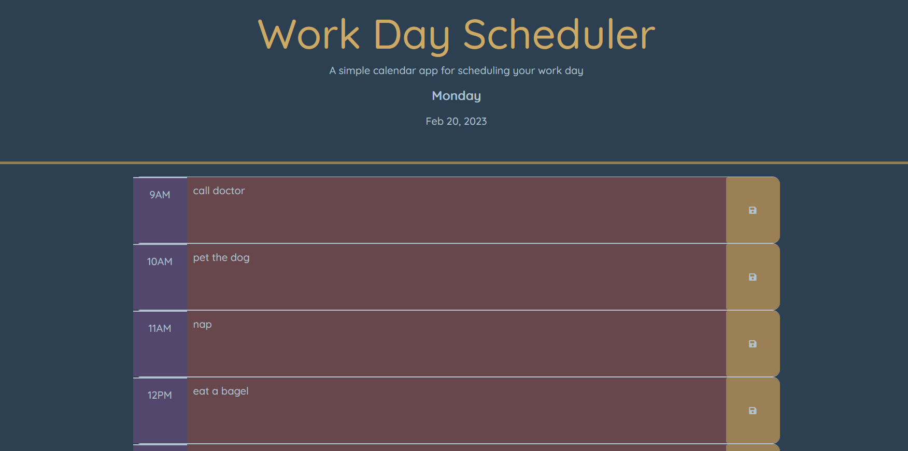

# Week 3 DU bootcamp challenge

### Focused on local storage, day.js, and researched parseInt and .each to make this project

## Day Calendar

### Type your daily appointments and click the save button. If the text area is red, that time is in the past, if it is blue, that time is now, and if it is green, that time is in the future.

## How

### The local storage method threw me as it didn't require the stringify/parse methods that I had originally learned but I was able to figure that out quickly. What took up most of my time was the past, present, future addClass functions. I eventually found a Stack Overflow post that was entirely unrelated to my issue but mentioned ParseInt and .each and began researching those functions. It took a bit for me to piece together but I eventually got it working. I tried to save the code I would have otherwise deleted to learn from my thought process - some of it got deleted, but there's a bit where you can see that I was planning on typing out the functions for the past, present, future classes on each time block specifically which violates the DRY methodology. I did end up wrapping my mind around it enough to stick it in an if/else if/else statement that worked.

https://jthornex.github.io/05-challenge-DU-bootcamp/

